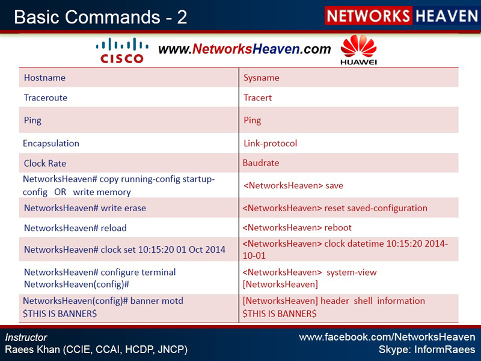
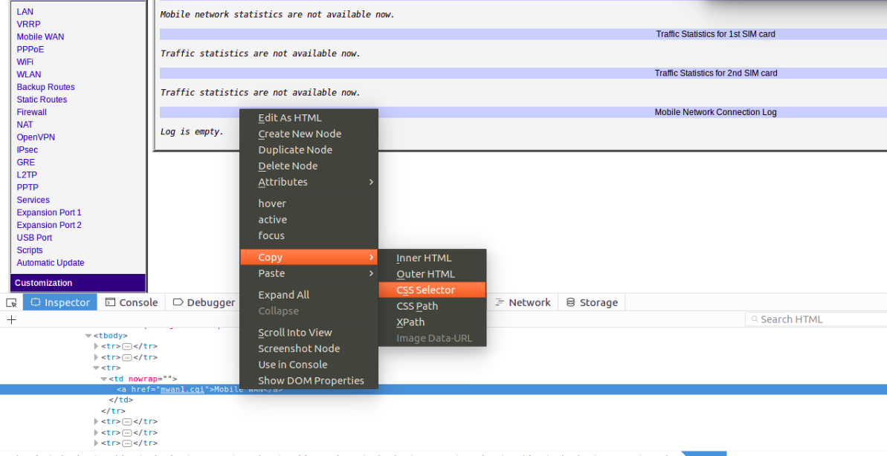
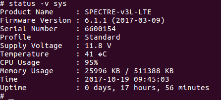
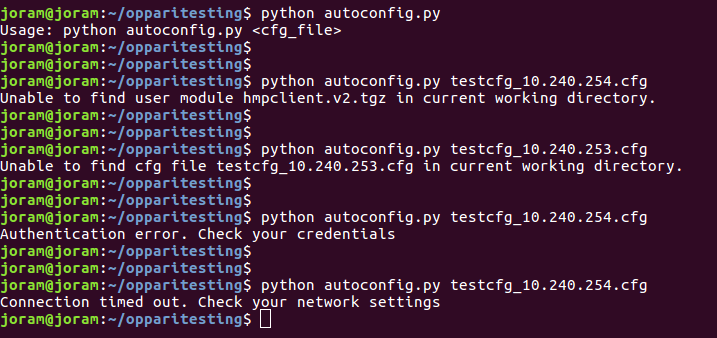
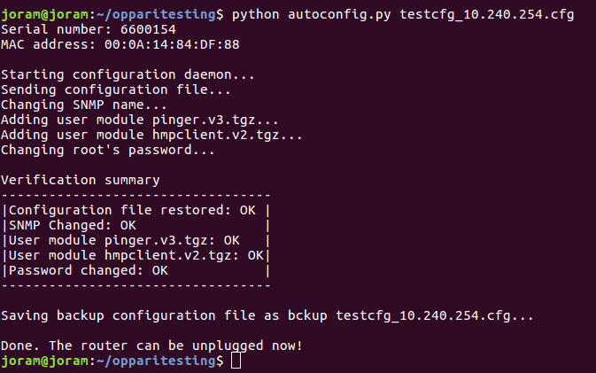

# Thesis - Automation of router configuration

Description text here

* Automation of router configuration
* Name: Joram Puumala
* E-Mail: a1500947@myy.haaga-helia.fi
* Supervisor: Tero Karvinen
* Haaga-Helia University of Applied Sciences
* Keywords: pytnon, vpn, configuration, router, automation

- - -

# Table of Contents

* 1 Introduction
    * 1.1 Background
    * 1.2 About this thesis
    * 1.3 Goals of the study
* 2 Router configuration
	* 2.1 Configuration management
		* 2.1.1 Configuration Management Systems
	* 2.2 Web Scraping
	* 2.3 Command line configuration
	* 2.4 Data manipulation with Regular Expressions
	* 2.5 Data conversion
* 3 Current state
* 4 Automating the process
	* 4.1 Automatic configuration
	* 4.2 Data extraction
	* 4.3 Data conversion
	* 4.4 Integration
* 5 Results
* 6 Future development
* 7 References
* 8 Appendix

# Introduction

## Background

Router orders are getting bigger, new customers and services are stirring the soup. NDC Networks is facing a serious problem, they are running out of resources. Router configuration by hand is no longer an option.

NDC Networks is a small Finnish company based in Espoo. The company is known for its expertise in networks, Virtual Private Network (VPN) management and router configuration. Routers that technicians at NDC Networks configure are mostly mobile routers. Different mobile routers do exist, but the basic idea is that it can be connected to mobile network using a traditional Subscriber Identity Module (SIM) card and is capable of changing its point of attachment to the Internet, moving from one link to another link (Ernst & Lach, 5). Because of the possible different features and demands though, configurations must be unique for each customer.

## About this thesis

## Goals of the study

Main goal of this study is to find out how to decrease used time and configuration errors in router configuration.

Research questions are:

- What is the best technology/technique to configure a router in this case and why?
- How much time can be saved, automation vs hand?
- How many fewer errors/misconfigurations will occur?

- - -

# Router configuration

Routers can be configured in different ways, depending on its model and manufacturer. Some routers have a fancy Web interface, while other routers can be configured only using text-based command line. Router configuration using a Web interface is usually pretty straightforward, since Web interfaces are designed so that even average Joes have some clue how to configure a router. Router configuration using a command line can be little trickier. Not only because some knowledge of how command line works is needed, but because commands may change radically between different router operating systems. For example, Cisco, which is dominating router market with share of 55.1% (IDC, 2017), has its own Cisco IOS operating systems with unique commands. Then again for instance, Huawei's routers run their own operating system, which means different commands apply when configuring the routers. 


> 

> Fig. 1 - Some basic command comparison - Cisco vs Huawei


Since routers can be configured using a Web interface or a command line, the configuration process can also be automated. Vendors like Cisco allow scripting on the command line, so this is a giant first step towards automation. 


## Configuration management

## Web scraping

Extracting patterned data from web pages in the Internet is called Web scraping. There are different uses for Web scraping, one major use is for businesses to track pricing activities of their competitors. Using Web scraping techniques time and labor can be saved in massive amounts. Web scraping can prove itself useful in the realm of research as well (Haddaway, 1-2).

The basic idea behind a Web scraping framework is that it establishes communication with user defined Web page using the HTTP protocol, which is a stateless text-based Internet protocol designated to coordinate the request-response transactions between a client and a Web server, in which the client is typically a Web browser. The "User-Agent" header also plays a big role, because it tells the server whether it is trying to be accessed by a robot or a browser. Once the Web scraping framework has retrieved the HTML documents using GET method, contents of interest can be extracted. Because extracting the contents of interest is relevant, regular expressions alone or with a combination of additional logic prove to be powerful and thus are widely adapted. Alternative methods include selector-based languages such as XPath and the CSS selector syntax (Glez-Peña, ?).


> 

> Fig. 2 - Copying CSS selector - one of the most used selector-based languages


Web scraping has some downsides too. It is slower than a simple HTTP request to a web server, because browser waits until the whole Web page is loaded before it allows you to access its elements. What is more, the browser generates more network traffic, which is because of the supplementary files being loaded such as image files, JavaScript and CSS, yet they usually don't prove to be useful. One of the biggest issues is that Web pages do change. This may break your code and you have to fix it to make it work again.

## Command line configuration


- - -

# Current state

There are currently lots of problems in NDC's router configuration. The greatest problem is that everything is done by hand using router's graphical web user interface. After having finished router configuration in the web GUI, Excel documents need to be updated with information such as router's serialnumber, MAC address, IP address and model, also manually by hand.


> 

> Fig. 3 - Routers' Web Interface


## The current process of router configuration:

1. Plug in the router
2. Browse to its default IP address
3. Log in using username and password
4. Click Restore Configuration
5. Click Add Configuration and browse to the right file
6. Click Add or Update
7. After confirmation takes you to another page, click Back
8. Click Services
9. Click SNMP under Services
10. Change SNMP name
11. Click Apply
12. Click Back
13. Click Change password
14. Type a new password twice
15. Click Apply
16. Click Back
17. Click User Modules
- Currently two user modules are added
18. Click Add new and browse to the right file
19. Click Add or Update
20. Click Back
21. Repeat 18.
22. Repeat 19.
23. Repeat 20.

This is the current process of router configuration done by hand. The process includes lots of clicking and browsing to files, which obviously takes time. Also, chances are that the person congifuring the router does something wrong and it had to be debugged and fixed later.

## The current process of updating Excel

1. Write router's VPN IP address
2. Write VPN IP address' netmask
3. Write router's serialnumber
4. Write router's MAC address
5. Write router's model
6. Write current date
7. Write sales reference

The Excel has to be updated after a router is configured, so this process is a part of the whole process.


> 

> Fig. 4 - Excel file in which the information above is stored


- - -

# Automating the process

Configuring thousands of routers by hand is time consuming and tedious. We humans also make mistakes. The best way to get rid of possible misconfigurations and speed up the process is to automate it. Let computer do all the work. This automation program that will be written is going to be designed particularly for Advantech B+B's mobile routers, which are running a Linux operating system with BusyBox software embedded in it. Even though this automation program is designed for Advantech's mobile routers, the idea is that it can be used for other routers also running a Linux operating system, with only minor changes.

> 

> Fig. 5 - Advantech B+B's SmartFlex mobile router

> 

> Fig. 6 - Advantech B+B's SmartStart LTE mobile router

The program will use a command line configuration technique over an SSH connection, which it initiates when the program is started. Language of choice is Python (3.5.2), because of its versatility, efficiency and simplicity. It will be a cross-platform program, which means it can be run in more than one operating system. The reason why the idea of using a Web scraping framework such as Selenium was ditched, because the code is fragile, meaning that even minor changes to the Web interface may break the code.

## Functions and configuration order

Before writing the actual code, it is important to know what has to be written and in which order. For example, router's new configuration file has to be in place before changing its SNMP name, because the new configuration file will overwrite SNMP settings including SNMP name.

Order of functions:
- 1. Initializing SSH connection
- 2. Fetching router's serial number and MAC address
- 3. Put new configuration file into router and run it
- 4. Change SNMP name
- 5. Add user modules
- 6. Change password
- 7. Download backup

- Additionally, for each task a functionality will be written to confirm the success of configuration. 

## Initializing SSH connection to router

Firstly, a connection needs to be established between the configuring computer and the router. The computer and the router are connected with an ethernet cable. So, the first step is to write a code snippet that initializes the connection over SSH. Python module "paramiko" will be used, which is a non-native module but can easily be installed using pip (instructions in Appendix).

```python
import paramiko

router_dflt_ip = "192.168.1.1" #default IP for the routers is always the same
uname = "root"
passwd = "Password3xample-"

ssh = paramiko.SSHClient()	#we define the ssh connection
ssh.set_missing_host_key_policy(paramiko.AutoAddPolicy())	#this is to prevent program from crashing 
ssh.connect(router_dflt_ip, username=uname, password=passwd)	#we establish the connection between our computer and router
```

The command "ssh.set_missing_host_key_policy(paramiko.AutoAddPolicy())" is important here because it automatically deals with host keys and saves lots of manual labour. To demonstrate what happens without this line, the line is removed and code run.

> 

> Fig. 7 - Running the program without "ssh.set_missing_host_key_policy(paramiko.AutoAddPolicy())" line

As it can be seen, "paramiko.ssh_exception.SSHException" error is raised. This is because there is a a missing host key. Now running the original program.

> 

> Fig. 8 - No errors are raised this time

This time the program runs without raising any errors. This means the SSH connection was succesfully created.

## Fetching router's serial number and MAC address

To fetch a router's serial number, the first thing is to know how to find it inside the router. Fortunately, command "status -v sys" exists. This command prints way too much information though, so grep and awk can be used to get just what we want.

> 

> Fig. 9 - status -v sys command run on router's command line

Now concatenating grep and awk to the command. First this is to grep for Serial Number to get the correct line, after which awk's print function can be used to print the correct column. The fixed command looks like this, "status -v sys |grep "Serial Number" |awk '{print $4}'".

> 

> Fig. 10 - This time, only serial number is printed out to standard output

Knowing how to get router's serial number, it is possible to write the function in Python.


```python
import paramiko

def get_serial():
	cmd = "status -v sys |grep \"Serial Number\" |awk '{print $4}'"	#command that prints serial number to standard output
	ssh_stdin, ssh_stdout, ssh_stderr = ssh.exec_command(cmd)	#executed command's output can be read from ssh_stdout
	outp = ssh_stdout.readlines()	#storing ssh_stdout in outp variable
	serial = outp[0].strip()	#serial number is the only item we have in tuple, and the tuple starts at 0
	return serial

router_dflt_ip = "192.168.1.1" #default IP for the routers is always the same
uname = "root"
passwd = "Password3xample-"

ssh = paramiko.SSHClient()	#we define the ssh connection
ssh.set_missing_host_key_policy(paramiko.AutoAddPolicy())	#this is to prevent program from crashing 
ssh.connect(router_dflt_ip, username=uname, password=passwd)	#we establish the connection between our computer and router

serial = get_serial()	#these two lines are just to confirm that the function
print(serial)		#works as expected.
```

First the command that prints router's serial number is put into cmd variable. When the command runs, all of its output will be stored in ssh_stdout variable. Variable outp is used to store values of ssh_stdout in a tuple, after which we the first and only item that is the serial number is chosen. 


> 

> Fig. 11 - Serial number is returned


It works as expected. Also, now it can be confirmed that an SSH connection was succesfully established between the computer and the router. Another very similar function needs to be created, but this time MAC address of eth0 port will be returned. The MAC address of router's eth0 port can be found running "ifconfig eth0" command. This again, gives too much additional information, so  grep and awk will be used again.


> 

> Fig. 12 - Router's eth0 interface

Concatenation of grep and awk to the original command will do the job; "ifconfig eth0 |grep "HWaddr" |awk '{print $5}'".


> 

> Fig. 13 - Only MAC address of eth0 interface is printed out on the screen this time

So now a Python function that fetches router's MAC address can be written. Because the function will not differ that much from the get_serial() function, it can be copied with minor changes.


```python
import paramiko

def get_mac():
	cmd = "ifconfig eth0 |grep \"HWaddr\" |awk '{print $5}'"	#command that prints mac address to standard output
	ssh_stdin, ssh_stdout, ssh_stderr = ssh.exec_command(cmd)	#executed command's output can be read from ssh_stdout
	outp = ssh_stdout.readlines()	#storing ssh_stdout in outp variable
	mac = outp[0].strip()	#mac address is the only item we have in tuple, and the tuple starts at 0
	return mac
	
router_dflt_ip = "192.168.1.1" #default IP for the routers is always the same
uname = "root"
passwd = "Password3xample-"

ssh = paramiko.SSHClient()	#we define the ssh connection
ssh.set_missing_host_key_policy(paramiko.AutoAddPolicy())	#this is to prevent program from crashing 
ssh.connect(router_dflt_ip, username=uname, password=passwd)	#we establish the connection between our computer and router

mac = get_mac()	#these two lines are just to confirm that the function
print(mac)	#works as expected.
```

> 

> Fig. 14 - Function get_mac() returns MAC address of router's eth0 interface

This time, when the Python program is run, MAC address is returned as expected. Now we there are two working functions that import two values of high importancy. For example, later SNMP name will be changed to router's serial number and both values will be written to Excel file.

## Restoring router's configuration

This is the first phase in which actual changes to router's current configuration are made. Every single router has its own unique configuration file. What makes the file unique are certificates and its VPN IP address. The VPN IP address is also used in the filename when it is created by NDC's server. For example, a typical configuration filename could be "customer_10.240.250.cfg". Now because the filename is unique for every router, it is a bad idea to put it inside the Python program. It would be time consuming and additional work to change it everytime before the program is run. So, instead of putting the filename inside the code, it will be given as a parameter, so that one number can easily be changed before re-running the program. To achieve this, "sys" module needs to be imported.

The syntax for the actual restore command inside the router is as simple as "restore <filename>". But before anything can be restored, the file has to be transferred to the router. Once the file is in the router, "restore <filename>" can be run. It is also a good practice to make sure that the command ran succesfully. If it did, "Configuration succesfully updated." will be printed to standard output. Now, it is possible to use this information to check whether everything went well or awry.


> 

> Fig. 15 - "Configuration succesfully updated." indicates success

Now all is pretty straightforward, so it can be put into the Python program.


```python
import paramiko
import sys

def restore_cfg(restore_file):
	orig = restore_f	#this is for clarity, file's origin (current dir)
	dest = "/root/" + restore_file	#destination of the file in router
	cmd = "restore " + dest	#restore command
	sftp = ssh.open_sftp()	#define sftp (secure version of ftp)
	sftp.put(orig, dest)	#put the file into router's /root/ dir
	ssh_stdin, ssh_stdout, ssh_stderr = ssh.exec_command(cmd) #status message will be caught 
	success = "Configuration successfully updated."
	outp = ssh_stdout.readlines()
	status = outp[0].strip() #status message will be here
        if status == success: #if status message = "Configuration successfully updated."
                status_msg = "OK"
        else:
                status_msg = "FAILED"
        return status_msg

router_dflt_ip = "192.168.1.1"	#default IP for the routers is always the same
uname = "root"
passwd = "Password3xample-"
restore_file = sys.argv[1]	#first parameter given to program

ssh = paramiko.SSHClient()	#we define the ssh connection
ssh.set_missing_host_key_policy(paramiko.AutoAddPolicy())	#this is to prevent program from crashing 
ssh.connect(router_dflt_ip, username=uname, password=passwd)	#we establish the connection between our computer and router

status = router_cfg(restore_file)
print(status)
```

> 

> Fig. 16 - In the Python program, "OK" indicates success

In this case, the program returns "OK" message which translates into "Configuration succesfully updated.". First the file is transferred to the router's /root/ directory, after which the command "restore testcfg_10.240.254.cfg" is run. The status message is caught and later used to determine whether the command was succesful or not.

## Changing SNMP name

SNMP settings are changed when the new configuration file is in use. You may wonder why can't the SNMP name be updated to the configuration file just like the other settings? This is because SNMP name needs to be the router's serial number and one doesn't know the serial number when the configuration files are created. It would be difficult to put this information into the configuration file and wreak havoc if serial numbers and files get mixed up.

SNMP name configuration can be found under /etc in settings.snmp file.


> 

> Fig. 17 - A snippet of settings inside /etc/settings.snmp


Probably the best tool available to make this kind of change is "sed". "sed" is a really powerful tool escpecially for text editing and data mining.   


> 

> Fig. 18 - sed makes magic happen


"sed -i 's/SNMP_NAME=.*/SNMP_NAME=testname/' /etc/settings.snmp" (stop cursive*) was run. As it can be seen, SNMP name changed to "testname". Now with the real case, the only difference is that the router's serial number has to be used instead.


```python
import paramiko
import sys

def get_serial():
	cmd = "status -v sys |grep \"Serial Number\" |awk '{print $4}'"	#command that prints serial number to standard output
	ssh_stdin, ssh_stdout, ssh_stderr = ssh.exec_command(cmd)	#executed command's output can be read from ssh_stdout
	outp = ssh_stdout.readlines()	#storing ssh_stdout in outp variable
	serial = outp[0].strip()	#serial number is the only item we have in tuple, and the tuple starts at 0
	return serial
	
def change_snmp(serial):
	cmd = "sed -i 's/SNMP_NAME=.*/SNMP_NAME=" + str(serial) + "/' /etc/settings.snmp"
	check = "sed -n 's/SNMP_NAME=//p' /etc/settings.snmp"
	ssh_stdin, ssh_stdout, ssh_stderr = ssh.exec_command(cmd)
	ssh_stdin, ssh_stdout, ssh_stderr = ssh.exec_command(check)
	outp = ssh_stdout.readlines()
        serialcheck = outp[0].strip()
        if str(serialcheck) == str(serial):
                state = "OK"
        else:
                state = "FAILED"
        return state

router_dflt_ip = "192.168.1.1" #default IP for the routers is always the same
uname = "root"
passwd = "Password3xample-"

ssh = paramiko.SSHClient()	#we define the ssh connection
ssh.set_missing_host_key_policy(paramiko.AutoAddPolicy())	#this is to prevent program from crashing 
ssh.connect(router_dflt_ip, username=uname, password=passwd)	#we establish the connection between our computer and router

serial = get_serial()
status = change_snmp(serial)
print(status)
```


> 

> Fig. 19 - Succesfully changed SNMP_NAME=


As it can be seen again, SNMP name has changed. This time the Python program first called get_serial() function to get router's serial number, after which it called change_snmp() function with one argument which was the serial number. Changing SNMP name is not rocket science, but there's always a possibility that something goes wrong. This is the reason why even the simplest change should be verified, and some kind of verification code added.

## Adding user modules

User modules are third party programs than can be added to routers. User modules are located under /opt directory. They are initially .tgz files, which will be decompressed and put into /opt directory. Before decompression is possible, user modules need to be transferred to a router. For this, the code for restore_cfg() function can be reused with some changes.


```python
import paramiko
import sys

def add_um(user_m, m_name):
        orig = user_m	#for clarity, origin of user module
        dest = "/opt/" + user_m	#destination of user module
        cmd = "tar -xzf " + dest + " -C /opt/"	#decompressed under /opt/
	check = "if [ -d \"/opt/" + m_name + "\" ];then echo OK;else echo NOT;fi" #checking that the user module exists
        sftp = ssh.open_sftp()
        sftp.put(orig, dest)
        ssh_stdin, ssh_stdout, ssh_stderr = ssh.exec_command(cmd)
	ssh_stdin, ssh_stdout, ssh_stderr = ssh.exec_command(check)
	outp = ssh_stdout.readlines()
        status = outp[0].strip()
        if status == "OK":
                status_msg = "OK"
        else:
                status_msg = "FAILED"
        return status_msg

	

router_dflt_ip = "192.168.1.1"	#default IP for the routers is always the same
uname = "root"
passwd = "Password3xample-"
user_m1 = "pinger.v3.tgz"
user_m1_name = "pinger"

ssh = paramiko.SSHClient()	#we define the ssh connection
ssh.set_missing_host_key_policy(paramiko.AutoAddPolicy())	#this is to prevent program from crashing 
ssh.connect(router_dflt_ip, username=uname, password=passwd)	#we establish the connection between our computer and router

status = add_um(user_m1):
print(status)
```


> 

> Fig. 20 - Program returns "OK" status message indicating success


> 

> Fig. 21 - Pinger module can be seen under /opt now

Again, Python program returns "OK" message, so in other words the pinger module has been transferred to the router succesfully. Now this function can be reused as many times as needed to add more user modules.


## Changing root password

Having passwords in clear text is always questionable, especially when the root account is concerned. In this case, it was agreed that it is okay as long as only authorized people have read and write permissions to the program. 

To change root's password without interacting, echo and chpasswd commands combined can be used. The whole command would be "echo 'root:<password>' |chpasswd". If the password was actually changed, status message "Password for 'root' changed" is printed to standard output, which can be caught again and used later to determine whether root's password change was a success or not.


```python
import paramiko
import sys

def change_pw(passwd):
	cmd = "echo 'root:"+ str(passwd) + "' |chpasswd"
	ssh_stdin, ssh_stdout, ssh_stderr = ssh.exec_command(cmd)
	outp = ssh_stdout.readlines()
	status = outp[0].strip()
	success = "Password for 'root' changed"
	if status == success:
		status_msg = "OK"
	else:
		status_msg = "FAILED"
	return status_msg

router_dflt_ip = "192.168.1.1"	#default IP for the routers is always the same
uname = "root"
passwd = "Password3xample-"
new_passwd = "Str0ngerandl0nger!-"

ssh = paramiko.SSHClient()	#we define the ssh connection
ssh.set_missing_host_key_policy(paramiko.AutoAddPolicy())	#this is to prevent program from crashing 
ssh.connect(router_dflt_ip, username=uname, password=passwd)	#we establish the connection between our computer and router

status = change_pwd(new_passwd)
print(status)
```


> 

> Fig. 22 - Status message "OK" indicates that the root password was succesfully changed


The root user's password was succesfully changed. Now the actual configuration is ready, but this is not the end yet. There are still two verifications to do and the Excel file needs to be updated.

## Getting backup file

Now that every configuration is verified, a backup file of the current configuration is needed, it will be stored in NDC's server. The reason why it is needed, is simply because restoring router configuration becomes easy in case if something goes awry. There's "backup" command that can be used to create the backup file. Command backup itself just prints router's current configuration to standard output, but it can easily be redirected to a file.


```python
import paramiko
import sys

def get_backup(filename):
	bu_file = "bckup" + filename
	cmd = "backup > " + bu_file
	orig = "/root/" + bufile
	ssh_stdin, ssh_stdout, ssh_stderr = ssh.exec_command(cmd)
        sftp = ssh.open_sftp()
        sftp.get(orig, bu_file)

router_dflt_ip = "192.168.1.1"	#default IP for the routers is always the same
uname = "root"
passwd = "Password3xample-"
restore_file = sys.argv[1]

ssh = paramiko.SSHClient()	#we define the ssh connection
ssh.set_missing_host_key_policy(paramiko.AutoAddPolicy())	#this is to prevent program from crashing 
ssh.connect(router_dflt_ip, username=uname, password=passwd)	#we establish the connection between our computer and router

get_backup(restore_file)
```

> 

> Fig. 23 - Backup file can be seen in the directory


This time, variable bu_file that contains the actual backup filename is used as the destination address of the file. This means the backup file will be saved under the same directory with the Python program. The next step is to put all the functions and code together. What is really important here, some checks need to be made, such as does every single file exists in the same directory with the Python program.

## Catching errors

There are many potential causes of errors. The idea is to get rid of most of them. Firstly, the Python program takes one parameter, an error will be raised if there are no parameters at all or too many.


> 

> Fig. 24 - No parameters to the script caused IndexError


Perfect, now the cause of error is known, so it can be prevented! Also, there are bunch of files defined in the code, so making sure the files really exists in the directory is necessary.

> 

> Fig. 25 - Missing file caused FileNotFoundError


The user module "pinger.v3.tgz" was changed to "pinger.v4.tgz" in the code. Because there is no such a file, FileNotFoundError is raised. Now this can also be prevented in the program. There are still two probable errors that can be easily spotted by just quickly looking at the code. Both are related to the SSH connection. When the SSH authentication happens, incorrect credentials will cause an error.


> 

> Fig. 26 - Wrong credentials caused an error


The username "root" was changed to "root1" in the code. Because the user doesn't exists, the credentials are deemed incorrect. This caused paramiko's own AuthenticationException exception to be raised. This will be prevented soon as well! The last probable cause of an error that can be easily spotted is incorrectly configured network settings. The Python program will keep on trying to connect to the router. Because the network settings are incorrect, the router cannot be found and connection is never established.


> 

> Fig. 27 - TimeoutError occured


TimeoutError was caused by misconfiguring network settings. Anyway, it took a really long time before the exception was raised. Now, it is important to remember that this configuration happens via ethernet cable. Anything more than five seconds indicates that there's something wrong with network settings. Luckily, it is possible to set user defined timeout. Timeout of five seconds should be enough, but it is a good practice to add some room, so timeout will be set to 15 seconds.


> 

> Fig. 28 - This time timeout was caused by socket


This time TimeoutError exception was not raised. The error was "socket.timeout". To be able to catch this error, module "socket" needs to be imported. Otherwise, NameError will be raised. Now that it is know what needs to be caught, it is time to strenghten the code and add more logic.


```python
import paramiko
import sys
import socket
import os

router_dflt_ip = "192.168.1.1"	#default IP for the routers is always the same
uname = "root"
passwd = "Password3xample-"
new_passwd = "Str0ngerandl0nger!-"
user_m1 = "pinger.v3.tgz"
user_m1_name = "pinger"
user_m2 = "hmpclient.v2.tgz"
user_m2_name = "hmpclient"

#checking that there's one parameter given to the program
try:
	restore_file = sys.argv[1]
except IndexError:
	print("Usage: python autoconfig.py <cfg_file>")
	sys.exit()

#checking if necessary files exist in current working directory
if not os.path.exists(user_m1):
	print("Unable to find user module " + user_m1 + " in current working directory.")
	sys.exit()
	
if not os.path.exists(user_m2):
	print("Unable to find user module " + user_m2 + " in current working directory.")
	sys.exit()
	
if not os.path.exists(restore_file):
	print("Unable to find cfg file " + restore_file + " in current working directory.")
	sys.exit()

try:
	ssh = paramiko.SSHClient()
	ssh.set_missing_host_key_policy(paramiko.AutoAddPolicy())
	ssh.connect(router_dflt_ip, username=uname, password=passwd, timeout=15)
#catching misconfigured network settings
except socket.timeout:
	print("Connection timed out. Check your network settings")
	sys.exit()
#catching incorrect credentials
except paramiko.ssh_exception.AuthenticationException:
	print("Authentication error. Check your credentials")
	sys.exit()

serial = get_serial()
mac = get_mac()

print("Serial number: " + str(serial))
print("MAC address: " + mac + "\n")
print("Starting configuration daemon...")

print("Sending configuration file...")
while True:
        restore_status = restore_cfg(restore_file)
        if restore_status == "OK":
                break

print("Changing SNMP name...")
while True:
	snmp_status = change_snmp(serial)
	if snmp_status == "OK":
		break

print("Adding user module " + user_m1 + "...")
while True:
	userm_status1 = add_um(user_m1, user_m1_name)
	if userm_status1 == "OK":
		break

print("Adding user module " + user_m2 + "...")
while True:
	userm_status2 = add_um(user_m2, user_m2_name)
	if userm_status2 == "OK":
		break

print("Changing root's password...\n")
while True:
	pw_status = change_pw(new_passwd)
	if pw_status == "OK":
		break

print("Verification summary")
print("----------------------------------")
print("|Configuration file restored: " + restore_status + "|")
print("|SNMP Changed: " + snmp_status + "|")
print("|User module " + user_m1 + ": " + userm_status1 + "|")
print("|User module " + user_m2 + ": " + userm_status2 + "|")
print("|Password changed: " + pw_status + "|")
print("----------------------------------\n")
print("Saving backup configuration file as bckup " + restore_file + "...\n")
get_backup(restore_file)
print("Done. The router can be unplugged now!")

ssh.close()
```


> 

> Fig. 29 - Exceptions were caught correctly


As it can be seen, catching errors works as expected.

> 

> Fig. 29 - The program ran succesfully


Perfect! The router is configured now. The idea behind the while loops are that the program will keep on trying until it succeeds in a task. There's of course the risk that for some unknown reason it never succeeds and will get stuck in infinite loop. Some more logic could be added. For example, the program could try three times and if it doesn't succeed, it returns "FAILED" and skips to its next task.

## Data Conversion

## Integration

- - -

# Results

- - -

# Future development

- - -

# References

- - -

# Appendix
